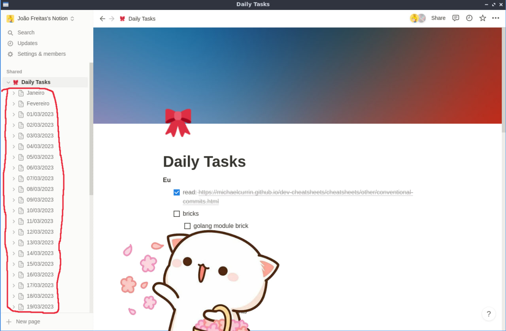

# notion-daily-task-worker

Scheduled Cloudflare Worker that prepares our daily task workflow every midnight.

## Why

Everyday me and  @rutesantos4 write down what we will work on that day in a Notion page. At the end of the day, we need to clone the same page and label it with a date, so we can build an history of what we have been working on. Doing this once or twice is cool, but doing it everyday for months is tedious.

That's why we created this tool. Everyday at midnight (well 1 AM to be precise, since there are day's we work past midnight), this function triggers and does this tedious manual process for us via the Notion API.



---

This worker was bootstrapped and configured with [wrangler](https://github.com/cloudflare/wrangler) CLI. You can install it via NPM: `npm install -g wrangler`

## Development

Run the local server via `wrangler dev --test-scheduled`

Trigger instant cron events via `curl "http://localhost:8787/__scheduled?cron=*+*+*+*+*"`

## Deploy

Setup worker environment variables with the following one-line:

```bash
IFS='='; ENV_FILE=.dev.vars; cat $ENV_FILE | while read line || [[ -n $line ]]; do read -ra envy <<< $line; wrangler secret put ${envy[0]} <<< ${envy[1]} ; done
```

Deploy to Cloudflare via `npm run deploy`
